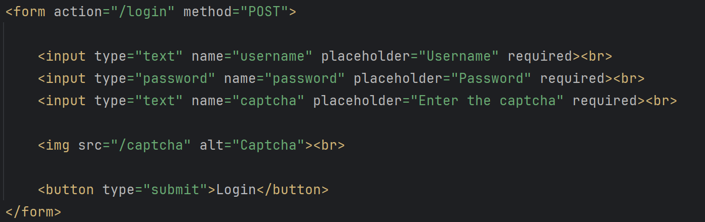
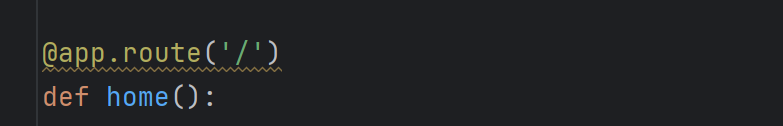
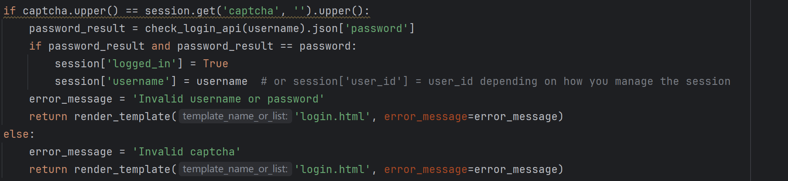
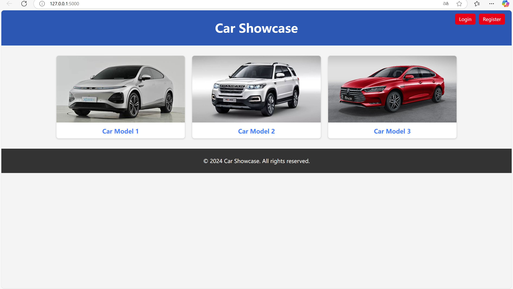
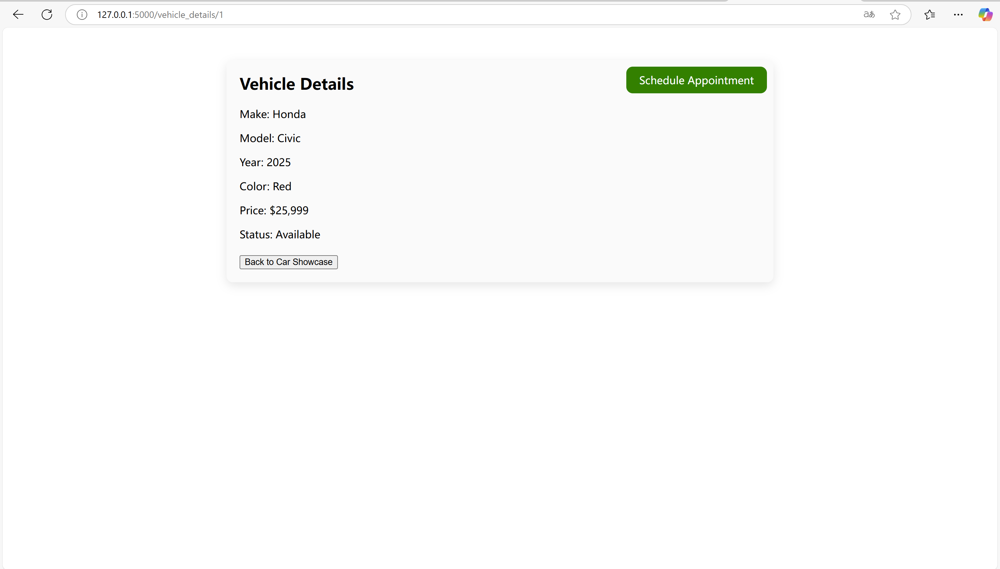
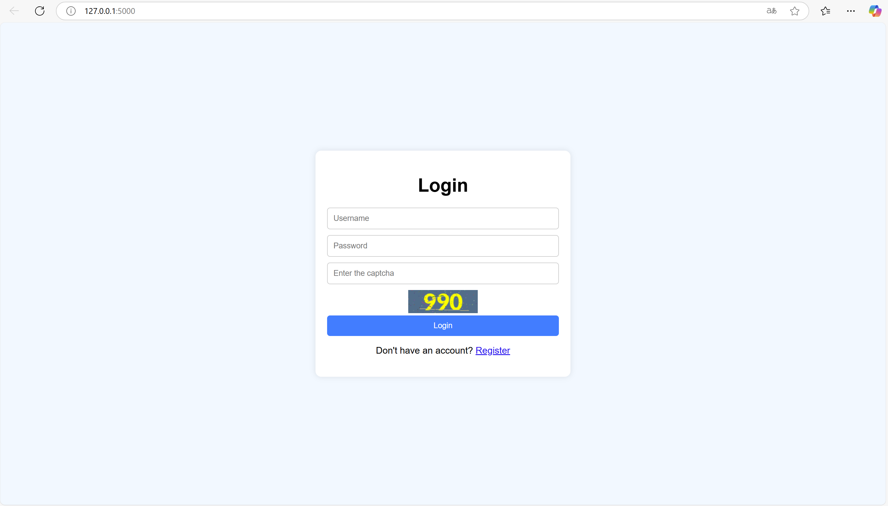
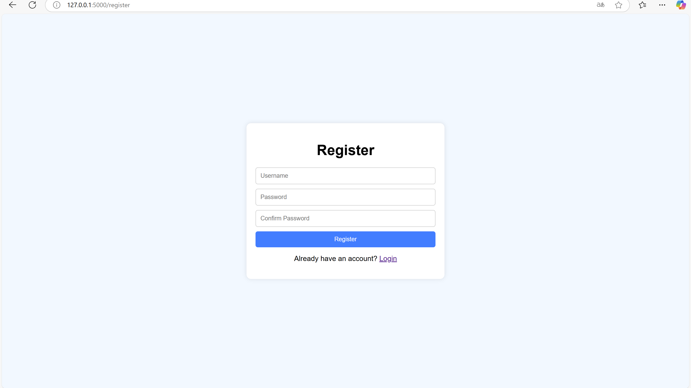
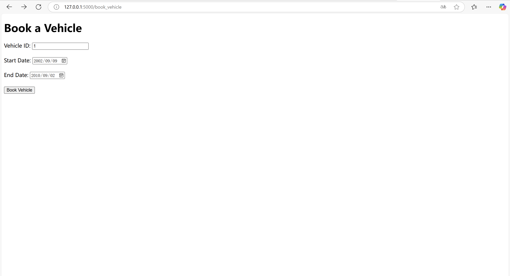
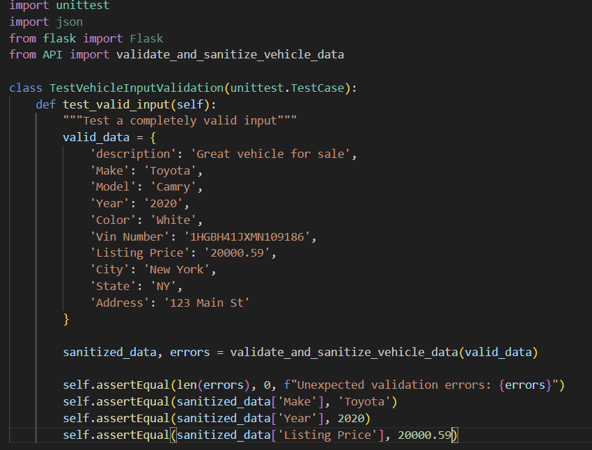

# Vehicle-Store-Database
Pitt MSIS INFSCI 2710 - Database Management Systems Final Project Design Document

[Github](https://github.com/Se7enB2st/Vehicle-Store-Database)

**Team**

- Ethan He (eth69@pitt.edu)
- Pengyao Li (pel131@pitt.edu)
- Xinyu Li (xil520@pitt.edu)

**Instructor: Vladimir Zadorozhny**

### Introduction/Abstract

- Streamlining vehicle search and management for renters and buyers. Effortlessly explore, list, and evaluate vehicle sale and rental options.
- Our platform provides a seamless, user-friendly experience, enabling users to navigate the complexities of vehicle searches with ease. Whether aiding renters in finding the perfect ride or guiding buyers to their ideal purchase, the app simplifies the entire process from start to finish. 


### E-R Model


### Business rules

| **Entity 1**  | **Entity 2**   | **Cardinality on Entity 1 side** | **Cardinality on Entity 2 side** | **Business Rule(s)**                                         |
| ------------- | -------------- | -------------------------------- | -------------------------------- | ------------------------------------------------------------ |
| User          | UserType       | m                                | n                                | A user can have multiple roles, and a role can apply to multiple users. |
| User          | Password       | 1                                | 1                                | Each user has a single password for security purposes and to avoid ambiguity. |
| User          | Review         | 1                                | m                                | Each user can leave multiple reviews, but a review belongs to one user only. |
| User          | Vehicle        | 1                                | m                                | Each user can own or rent multiple vehicles, but a vehicle is associated with only one user at a time. |
| User          | Booking        | 1                                | m                                | Our system allows each user to create multiple bookings, but each booking belongs to one user only. |
| Vehicle       | Booking        | 1                                | m                                | Each vehicle can be part of multiple bookings, but a booking involves only one vehicle. |
| Vehicle       | Review         | 1                                | m                                | Our system allows each vehicle to have multiple reviews. But a review can only belong to one vehicle. |
| Vehicle       | VehicleDetail  | 1                                | 1                                | Each vehicle must have detailed information (e.g., make, model, year, VIN#, color). Our system allows each vehicle to have only one detail, to avoid ambiguity. |
| Vehicle       | MarketListings | 1                                | 1                                | Our system allows each vehicle to have only one MarketListings, to avoid ambiguity. |
| Vehicle       | Contract       | 1                                | m                                | Our system allows each vehicle belong to multiple contracts. But a contract can only contain one vehicle. |
| Vehicle       | Image          | 1                                | 1                                | Our system allows each vehicle to have only one image, to avoid ambiguity. |
| Contract	| User	    	 | 1	  			    | m	                               | Each user can have multiple contracts, but a contract belongs to one user only. |
| Contract	| Vehicle	 | 1	  			    | m	                               | Each vehicle can belong to multiple contracts, but a contract is associated with only one vehicle.|
| Payment       | Contract       | 1                                | m                                | Our system allows each payment to be used by multiple contracts. But a contract can only have one payment. |
| PaymentMethod | Payment        | 1                                | m                                | Our system allows each payment method to be used by multiple payments. But a payment can only have one payment method. |


### DDL Statment
~~~SQL
-- User Table
CREATE TABLE User (
	user_id INT NOT NULL AUTO_INCREMENT PRIMARY KEY,
    username VARCHAR(50) NOT NULL UNIQUE -- Ensure usernames are unique
) ENGINE=InnoDB;

CREATE TABLE Password (
    password_id INT NOT NULL AUTO_INCREMENT PRIMARY KEY,
    password VARCHAR(255) NOT NULL
) ENGINE=InnoDB;

CREATE TABLE UserUsePassword (
    user_id INT UNIQUE,
    password_id INT,
    PRIMARY KEY (user_id, password_id),
    CONSTRAINT fk_user_id1 FOREIGN KEY (user_id) REFERENCES User(user_id),
    CONSTRAINT fk_password_id1 FOREIGN KEY (password_id) REFERENCES Password(password_id)
) ENGINE=InnoDB;

-- Vehicle Table
CREATE TABLE Vehicle (
    vehicle_id INT AUTO_INCREMENT PRIMARY KEY,
    user_id INT NOT NULL,
    FOREIGN KEY (user_id) REFERENCES User(user_id) ON DELETE CASCADE -- Cascade delete to clean up associated vehicles when a user is deleted
);

-- VehicleInfo Table
CREATE TABLE VehicleInfo (
    vehicleinfo_id INT AUTO_INCREMENT PRIMARY KEY,
    vehicle_id INT NOT NULL,
    year INT NOT NULL CHECK (year >= 1886), -- Ensures year is valid (1886 is the year of the first car)
    make VARCHAR(50) NOT NULL,
    model VARCHAR(50) NOT NULL,
    vin VARCHAR(17) NOT NULL UNIQUE, -- VIN should be unique
    color VARCHAR(50) NOT NULL,
    listing_date DATE NOT NULL,
    listing_price DECIMAL(10, 2) NOT NULL, -- Specify precision for decimals
    status VARCHAR(20) NOT NULL CHECK (status IN ('Available', 'Sold', 'Pending')), -- Limit valid status values
    FOREIGN KEY (vehicle_id) REFERENCES Vehicle(vehicle_id) ON DELETE CASCADE -- Ensure vehicle details are cleaned up if the vehicle is deleted
);

-- Review Table
CREATE TABLE Review (
    review_id INT AUTO_INCREMENT PRIMARY KEY,
    user_id INT NOT NULL,
    vehicle_id INT NOT NULL,
    rating INT NOT NULL CHECK (rating BETWEEN 1 AND 5), -- Rating should be between 1 and 5
    comments VARCHAR(255),
    FOREIGN KEY (user_id) REFERENCES User(user_id) ON DELETE CASCADE, -- Cleanup reviews if user is deleted
    FOREIGN KEY (vehicle_id) REFERENCES Vehicle(vehicle_id) ON DELETE CASCADE -- Cleanup reviews if vehicle is deleted
);

-- Booking Table
CREATE TABLE Booking (
    booking_id INT AUTO_INCREMENT PRIMARY KEY,
    user_id INT NOT NULL,
    vehicle_id INT NOT NULL,
    start_date DATE NOT NULL,
    end_date DATE NOT NULL,
    FOREIGN KEY (user_id) REFERENCES User(user_id) ON DELETE CASCADE, -- Cleanup bookings if user is deleted
    FOREIGN KEY (vehicle_id) REFERENCES Vehicle(vehicle_id) ON DELETE CASCADE -- Cleanup bookings if vehicle is deleted
);

-- Contract Table
CREATE TABLE Contract (
    contract_id INT AUTO_INCREMENT PRIMARY KEY,
    user_id INT NOT NULL,
    vehicle_id INT NOT NULL,
    signing_date DATE NOT NULL,
    contract_price DECIMAL(10, 2) NOT NULL, -- Specify precision for decimals
    FOREIGN KEY (user_id) REFERENCES User(user_id) ON DELETE CASCADE, -- Cleanup contracts if user is deleted
    FOREIGN KEY (vehicle_id) REFERENCES Vehicle(vehicle_id) ON DELETE CASCADE -- Cleanup contracts if vehicle is deleted
);

-- PaymentMethod Table
CREATE TABLE PaymentMethod (
    payment_method_id INT AUTO_INCREMENT PRIMARY KEY,
    method VARCHAR(50) NOT NULL UNIQUE -- Payment method names should be unique
);

-- Payment Table
CREATE TABLE Payment (
    payment_id INT AUTO_INCREMENT PRIMARY KEY,
    contract_id INT NOT NULL,
    payment_method_id INT NOT NULL,
    amount DECIMAL(10, 2) NOT NULL, -- Specify precision for decimals
    payment_date DATE NOT NULL,
    FOREIGN KEY (contract_id) REFERENCES Contract(contract_id) ON DELETE CASCADE, -- Cleanup payments if contract is deleted
    FOREIGN KEY (payment_method_id) REFERENCES PaymentMethod(payment_method_id)
);
~~~

### Front-end Design
- The "form" element is used to connect the front-end to the back-end, specifying the destination path and method via action and method.


### Front-end and Back-end Interactions

#### Basic elements:
#### Flask backend logic routing
- Flask's @app.route defines the backend logic that receives, processes, and returns request results.


#### Template engine (Jinja2):
- Flask's render_template dynamically renders HTML pages, passing in variables such as error_message.


#### Flask redirect function
- Use Flask's redirect function to realize the page jump.

### How it works:
When a user accesses the system's page, the Flask backend processes the request through routing and returns the HTML page to the user's browser using render_template, containing form elements (such as input boxes, checkboxes, buttons, etc.).

- Once the user sees the page in their browser, they submit the form information by filling out the form and clicking the submit button. After the original form element defined in the html to realize the interaction with the request.form in the route of flask.

- Through method=“POST” to realize the HTTP POST request to send the completed form to the route of flask.

- On the backend, Flask receives the POST request and gets the form data submitted by the user through request.form.

If the form data submitted by the user is to be stored, the backend will validate the data (e.g., check if the required fields are empty).
If the data is validated, the backend will use the database connection library (pymysql) to connect to the MySQL database, and then insert the form data into the database through SQL statements.

- The backend will return a response when the insertion operation is complete. If the insertion is successful, the backend redirects the user to a new page. If the insertion fails, the backend returns an error message and can display the appropriate error message on the page.

If the data on the form is to be validated, for example, user login. Then if the CAPTCHA validation passes, the backend will continue with the username and password validation.

- The backend verifies that the user name and password provided by the user are correct by querying the database for the user information (using pymysql to connect to the database and execute the SQL query). 

If the validation is successful, the backend stores the user's login status in the session and redirects to the appropriate user dashboard page based on the type of user.

If username or password validation fails, the backend will re-render the login page via render_template with an error message indicating that the username or password entered by the user is invalid. The user can then re-fill the form according to the error message and submit again.

### Demo
- Vehicle display page:


- Vehicle search function:


- Data aggregation function - ability to generate a search and list of vehicles based off listing price and give average price and total number of vehicles that are available.


- Vehicle details page:


- Login page:


- Register page:


- Book page:


### Testing Case
During the project, tests were run regularly using both manual curl tests to and automated test unit to checks various input scenarios.
```
curl -X POST http://127.0.0.1:5000/register -H "Content-Type: application/json" -d "{\"username\": \"test_user\", \"password\": \"test_password\", \"confirm_password\": \"test_password\"}"

```


We also implement proper error handling in our API methods to handle a wide range of errors. As well as creating a test environment to test the database query.

### Future Improvment
In the future, the application is planning to add a review feature. While reviews are not necessary, they allow users to see ratings that help renters or buyers make informed decisions by seeing feedback from others.

Reviews can also motivate sellers to maintain high-quality listings.

Currently the plan is to add a star rating system from 1 to 5 stars. This will give the end user the ability to filter listings based off rating. As of right now, users can search for vehicles based off make and model.

The overall front end will need to be revamped as this is an MVP (minimum viable product). The user interface will need to be improved as well as making the application more secure for expansion to process payment online.


